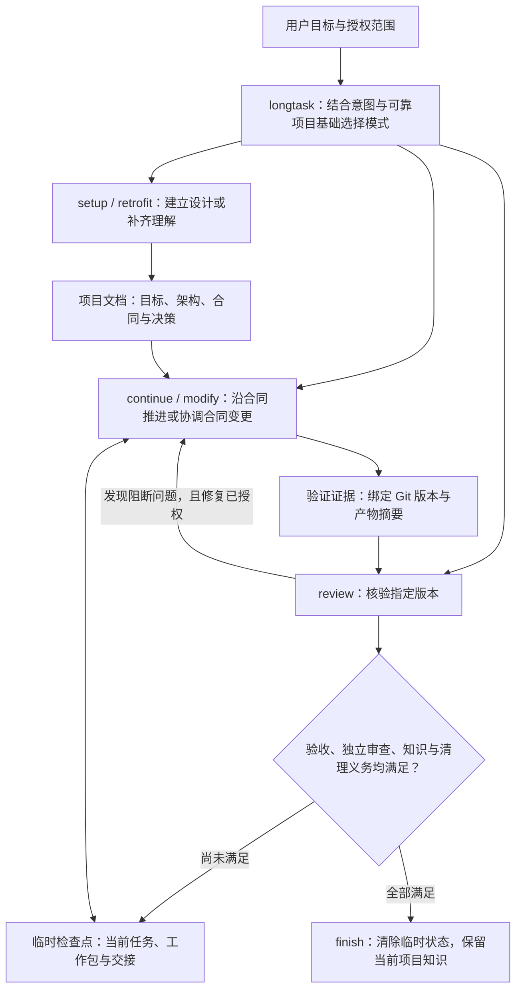

# longtask

**让复杂编码任务跨上下文、跨会话继续推进。**

[](https://github.com/J-ChenX/longtask/actions/workflows/ci.yml)
[](LICENSE)
[](https://www.python.org/downloads/)
[](https://agentskills.io/specification)

longtask 是面向 Codex 的个人编码技能插件。它保存项目知识和未完成任务的检查点，让新会话知道目标、进展和下一步；通过当前版本的验证与审查后，清除临时状态。

[快速开始](#快速开始) · [模式与场景](#模式与场景) · [文档导航](#文档导航) · [参与贡献](#参与贡献)

## 4.1.0 更新

公开入口收束为 `$longtask`，原五个子技能保留为内部工作流，按用户意图与可靠项目基础自动选择、按需加载。触发边界和场景见下文；使用变化、兼容性与验证范围见[4.1.0 版本说明](版本说明.md#410)。

## 适用场景

- 任务需要跨越上下文压缩、重启或多次会话。
- 多个工作包需要分别验收，并协调依赖和集成。
- 架构与决策需要长期维护，验证结果需要对应当前版本。

小改动、解释和普通审查无需自动启用。多窗口协作按实际需要使用隔离工作树；longtask 不替代 Git、CI 或身份认证，也不提供分布式调度。

## 快速开始

需要 **Codex 和 Python 3.14+**；脚本仅使用标准库。Git 可提供版本证据和工作树隔离。

### 1. 获取并验证插件

从源码构建候选归档：

```bash
git clone https://github.com/J-ChenX/longtask.git
cd longtask
python3 scripts/build_release.py build --root . --output dist/longtask-4.1.0.zip
python3 scripts/build_release.py verify --root . --archive dist/longtask-4.1.0.zip
```

构建与验证确认归档和源码一致。安装及发布还需相应验收证据；其他渠道的归档须核对受信 SHA-256。

### 2. 安装完整插件

按[安装指南](references/发布与恢复.md#个人-codex-安装)配置完整插件目录和个人 marketplace，再执行：

```bash
codex plugin add longtask@personal
```

启动新会话，确认插件只提供 `$longtask` 一个入口。旧同名技能和安装缓存的处理也见安装指南。

### 3. 提出目标

```text
用 $longtask 推进这个需要多次会话完成的编码任务，明确验收并保存恢复信息。
```

只想规划时，直接说明“先规划，不实施”；需要恢复或审查时，在同一个入口中说明目标与范围。

## 模式与场景

统一使用 [`$longtask`](SKILL.md)。需要跨会话恢复、协调独立验收包或长期保留决策时可自动触发；也可以明确指定使用。普通局部修改、解释和单次审查不因关键词而自动启用。

原五个子技能不再单独注册。下面以“企业报销系统”为例解释内部模式；执行判断以[主技能的模式参考](SKILL.md#模式参考)为准，用户无需记忆模式名称。

| 模式 | 何时进入 | 典型场景 | 边界 |
|---|---|---|---|
| [setup：建立基础](references/新建项目.md) | 当前交付对象没有实现基础，需要从目标建立设计与验收。 | “用 longtask 从零规划报销系统，先明确业务流程、架构与验收。” | 已有项目沿明确合同增加功能通常进入 continue；只规划时交付设计与恢复信息，不自动实施。 |
| [retrofit：补齐理解](references/既有项目接入.md) | 已有实现，但可靠目标、结构或合同缺口妨碍接手和后续工作。 | “接手这个能运行的报销系统，前任说明不可靠，请厘清现有行为和意图后继续开发。” | 围绕当前目标补齐依据；有文档不代表依据可靠，无文档也不要求全库盘点。单纯整理已明确文档进入 continue。 |
| [continue：沿约定推进](references/任务续接.md) | 当前目标与合同仍适用，需要继续实现、修复、验证或维护文档。 | “审批规则已确定，继续完成附件上传、修复重复提交问题并补齐验收。” | 不限于恢复中断；可恢复有效检查点或为可靠架构建立当前状态。偏离原合同的实现通常在此修复。 |
| [modify：改变约定](references/架构变更.md) | 已建立的业务规则、架构、职责、接口、工作流或关键技术需要改变。 | “单级审批改为按金额分级审批，请调整合同、接口和相关工作包。” | 普通代码编辑、改动文件多或按原合同修漏洞不等于 modify；先协调受影响合同和证据，不覆盖原任务。 |
| [review：核验成果](references/任务审查.md) | 明确要求 longtask 审查，或当前任务需要版本绑定的独立检查。 | “请用 longtask 只读审查审批规则、权限和验收证据，不修改实现。” | 对照当前批准的目标、合同与验收，而非只对照最初架构；可在中途审查。独立性由审查者与上下文隔离保证，切换模式本身不证明独立性。 |

明确意图优先于状态建议，“只规划”“只查看”“只审查”限定执行范围。检查点和文档提供判断依据，不授予权限；状态无效、过期或冲突时先诊断协调，不自动迁移或重新初始化。

同一任务可以先接入已有实现，再继续开发、改变必要合同并审查成果，内部模式随当前工作切换。文档与代码不一致时先确认批准合同：实现偏离合同属于修复，用户要求改变合同才进入 modify；意图不清楚时补齐依据或澄清。

可控任务优先在一个对话内完成；需要拆分时，按[分段交付与会话交接](references/任务推进.md)组织工作。

## 工作原理

longtask 通过一个入口选择当前工作流，把长期项目知识与临时执行状态分开保存，并用当前版本的验证与审查判断是否完成。



### 一次任务怎样推进

1. **确定目标和范围。** 明确要交付什么、怎样验收，以及本轮是只规划、只查看、只审查还是完整实施。已有授权继续有效，路由建议不会增加权限。
2. **选择当前模式。** 从零建立基础用 setup；已有实现缺少可靠依据用 retrofit；沿现有合同完成工作用 continue；改变已有合同用 modify；核验指定成果用 review。同一任务可以先后使用多个模式。
3. **读取必要输入并推进。** 有有效检查点时校验目标、工作包、依赖和交接；没有检查点时从可靠项目知识建立本次工作基础。只加载当前目标需要的参考和合同，按可验收工作包实施。
4. **验证当前成果。** 测试与独立审查绑定具体版本和产物摘要。发现失败后在已授权范围内修复并重新验证；局部通过不能代替全部目标完成。
5. **保存或收尾。** 中断、移交或仅规划时保留新鲜检查点；全部完成条件满足时更新当前项目知识，运行完成检查并清除临时状态。

### 三类资料各自回答什么

| 资料 | 回答的问题 | 保存位置与生命周期 |
|---|---|---|
| **持久项目知识** | 要做什么、为什么这样设计、模块如何协作、怎样验收？ | 架构、模块与决策文档长期维护当前事实和合同；不追加任务流水。 |
| **临时恢复检查点** | 当前任务推进到哪里、哪些包未完成、下次需要什么输入？ | 工作区唯一的 `.longtask/state.json`，未完成时保留，收尾后清除。 |
| **版本绑定证据** | 哪项测试或审查实际检查了哪个版本，结论现在是否仍适用？ | 本次任务的结构化证据绑定 Git 与摘要；相关产物或条件改变后重新核验，不能直接沿用旧通过。 |

批准目标和合同定义预期行为，代码与运行结果证明已观察行为；两者冲突时需要协调。longtask 用授权与风险门限制动作，用行为评测检查技能本身的触发和推进质量。检查点不是授权，文档齐全不是运行通过，测试通过也不自动证明整体完成。

恢复与资料读取的具体命令见[操作示例](references/操作示例.md)和[知识检索接口](docs/modules/文档架构.md#知识检索接口)。

## 兼容性与验证边界

**4.1.0 仅支持 Codex。** 不读取或迁移其他技能版本的检查点（含 4.0.0），不支持跨版本回滚；故障恢复使用同版本受信工件。

CI 和本地合同测试证明源码结构及可复现行为。真实宿主发布资格与效率收益需要各自的版本绑定证据，不能从 CI 通过推导。运行结果不进入 Git 或安装包，详见[项目规范](AGENTS.md#源码与产物架构规范)与[发布门](references/发布与恢复.md#单宿主发布门)。

推送与插件版本一致的 `vX.Y.Z` 标签后，GitHub Actions 自动检查、打包并上传安装 ZIP 与校验文件到候选预发布。普通 commit 不生成 Release；候选不会自动升级为正式发布，条件见[标签发布合同](references/发布与恢复.md#github-候选预发布)。

## 本地验证

在仓库根目录使用 Python 3.14+：

```bash
python3 scripts/validate_longtask.py
python3 -m unittest discover -s tests -v
python3 scripts/run_skill_evals.py
python3 scripts/run_forward_evals.py --run
```

这些检查不需要已保存的运行结果。显式核验本地证据用 `validate_longtask.py --with-evaluation-results`，安装工件自检用 `--installed`；正式发布仍须通过 `--require-release-pass`。环境配置、证据更新和命令细节见[贡献指南](https://github.com/J-ChenX/longtask/blob/main/.github/CONTRIBUTING.md#验证变更)。

## 文档导航

| 需要了解 | 阅读 |
|---|---|
| 架构、模块和设计依据 | [架构入口](docs/ARCHITECTURE.md) |
| Skill 格式与仓库维护 | [仓库维护](docs/仓库维护.md) |
| 状态、检查点、授权与完成 | [状态协议](references/状态协议.md) |
| 持久知识与文件命名 | [文档架构](文档架构.md) |
| 独立审查与发现关闭 | [专家审查协议](专家审查协议.md) |
| 多窗口协作与集成 | [平行任务协作](references/平行任务协作.md) |
| 评测方法与证据边界 | [评测协议](references/评测协议.md) |
| 安装、发布与同版本恢复 | [发布与恢复](references/发布与恢复.md) |

## 参与贡献

请先阅读[贡献指南](https://github.com/J-ChenX/longtask/blob/main/.github/CONTRIBUTING.md)与[行为准则](https://github.com/J-ChenX/longtask/blob/main/.github/CODE_OF_CONDUCT.md)，再提交可复现的 [Issue](https://github.com/J-ChenX/longtask/issues/new/choose) 或聚焦的 Pull Request。安全问题按[安全政策](https://github.com/J-ChenX/longtask/blob/main/.github/SECURITY.md)私下报告。

项目采用 [MIT 许可证](LICENSE)；格式遵循 [Agent Skills 规范](https://agentskills.io/specification)，发现与分发参照 [Codex 官方文档](https://developers.openai.com/codex/skills)。
