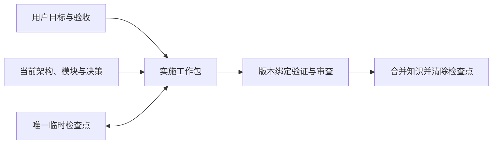

# longtask

**让复杂编码任务跨上下文、跨会话继续推进。**

[](https://github.com/J-ChenX/longtask/actions/workflows/ci.yml)
[](LICENSE)
[](https://www.python.org/downloads/)
[](https://agentskills.io/specification)

longtask 是面向 Codex 个人使用的开源 Skill 插件。它把当前项目知识、未完成工作和版本绑定证据分开保存，让新会话能恢复目标、判断哪些结果仍然有效，并继续完成可验收的工作。

[快速开始](#快速开始) · [入口技能](#入口技能) · [文档导航](#文档导航) · [参与贡献](#参与贡献)

## 适用场景

- 一项编码任务必须跨越上下文压缩、重启或多次会话。
- 多个工作包有各自的验收、依赖和集成边界。
- 架构与决策需要留给后续维护者，完成声明需要对应当前产物。
- 独立窗口在各自工作树中实施，需要明确公共合同与集成负责人。

单次会话即可完成的小改动、解释和普通审查无需自动启用 longtask。它不是分布式调度器、身份认证服务或 Git/CI 的替代品。

## 快速开始

需要 **Codex** 与 **Python 3.10+**；运行脚本仅使用 Python 标准库。Git 可提供版本证据与工作树隔离。

### 1. 获取并验证完整插件

开发者可以从源码构建候选归档：

```bash
git clone https://github.com/J-ChenX/longtask.git
cd longtask
python3 scripts/build_release.py build --root . --output dist/longtask-3.0.0.zip
python3 scripts/build_release.py verify --root . --archive dist/longtask-3.0.0.zip
```

构建成功表示归档与源码一致。**安装与正式发布还需要对应的验收证据。** 从其他渠道取得归档时，使用受信渠道提供的 SHA-256 验证完整工件。

### 2. 安装

按[安装与恢复指南](references/发布与恢复.md#个人-codex-安装)将已验证的完整插件放入个人 marketplace，再执行：

```bash
codex plugin add longtask@personal
```

新会话应能发现下表中的六个入口。安装目录、旧同名技能处理、市场条目及缓存刷新以指南为准。

### 3. 提出目标

```text
用 $longtask 推进这个需要多次会话完成的编码任务，明确验收并保存必要的恢复信息。

用 $longtask-continue 校验当前检查点并继续未完成工作。

用 $longtask-review 独立审查当前实现和完成证据。
```

实际命令、只规划时的断点、失败恢复及工作树使用见[操作示例](references/操作示例.md)。

## 工作原理



持久文档回答“项目现在有什么、如何工作、如何验证”；`.longtask/state.json` 只支持未完成工作的续接，收尾后清除。Git 版本和 SHA-256 摘要把批准、审查和完成声明绑定到具体产物。代码描述已观察行为，已批准目标与合同定义预期行为；两者冲突时保持可见并协调。

## 入口技能

| 场景 | 入口 | 说明 |
|---|---|---|
| 自动选择工作流 | [`longtask`](SKILL.md) | 根据当前状态与请求路由 |
| 真正的新项目 | [`longtask-setup`](skills/longtask-setup/SKILL.md) | 保存目标并逐步形成架构与计划 |
| 中断或压缩后恢复 | [`longtask-continue`](skills/longtask-continue/SKILL.md) | 校验恢复信息，继续未完成工作 |
| 独立审查 | [`longtask-review`](skills/longtask-review/SKILL.md) | 默认只读，按风险验证证据 |
| 架构或工作流变更 | [`longtask-modify`](skills/longtask-modify/SKILL.md) | 明确影响范围并更新合同 |
| 已有代码缺少架构与检查点 | [`longtask-retrofit`](skills/longtask-retrofit/SKILL.md) | 区分观察、推断与批准意图 |

六个入口通过 `.codex-plugin/plugin.json` 的 `./skills/` 统一发现，随根技能、工具与参考组成完整发布闭包。各入口的 UI 元数据位于对应的 `agents/openai.yaml`。

## 兼容性与验证边界

**3.0.0 是破坏性版本，仅支持 Codex。** 不读取或迁移 1.x/2.x 状态，不提供 Claude Code 兼容分支或跨版本回滚；故障恢复使用同版本受信工件完整重装。

| 证据层 | 能证明什么 |
|---|---|
| 静态检查与确定性打包 | 结构、引用、元数据与归档闭包一致 |
| 单元测试与前向合同测试 | 本地状态 CLI 的可复现行为 |
| 调用分类评测 | 记录的触发与入口选择；不证明真实宿主执行 |
| Codex 宿主矩阵与恢复演练 | 当前归档在真实宿主上的核心发布资格 |
| 对照与性能评测 | 有数据支持的效率或成本收益 |

CI 徽章仅表示仓库检查状态。核心发布与收益资格分别由 `release_gate` 和 `benchmark_gate` 判断；最新候选记录见源码侧的[宿主评测结果](https://github.com/J-ChenX/longtask/blob/main/evals/host_results.json)。这些易变运行结果不随插件安装，正式发布门见[发布与恢复](references/发布与恢复.md#单宿主发布门)。

## 本地验证

在仓库根目录运行：

```bash
python3 scripts/validate_longtask.py
python3 -m unittest discover -s tests -v
python3 scripts/run_skill_evals.py --results evals/invocation_results.json
python3 scripts/run_forward_evals.py
```

输入变化后，应实际重跑对应评测并更新版本绑定记录；开发步骤见[贡献指南](https://github.com/J-ChenX/longtask/blob/main/.github/CONTRIBUTING.md)。`release-manifest.json` 是唯一发布清单，`dist/` 是可清除的构建输出。提取后的完整工件可执行 `python3 scripts/validate_longtask.py --installed` 自检。

## 文档导航

| 需要了解 | 阅读 |
|---|---|
| 当前架构、模块图与设计依据 | [架构入口](docs/ARCHITECTURE.md) |
| Skill 格式、仓库内容规范与维护方式 | [仓库维护](docs/仓库维护.md) |
| 状态、授权、检查点与完成合同 | [状态协议](references/状态协议.md) |
| 持久知识的层级与命名 | [文档架构](文档架构.md) |
| 风险审查与发现关闭 | [专家审查协议](专家审查协议.md) |
| 多窗口、外部合同与有界集成 | [平行任务协作](references/平行任务协作.md) |
| 评测方法与保证边界 | [评测协议](references/评测协议.md) |
| 安装、发布与同版本恢复 | [发布与恢复](references/发布与恢复.md) |

## 参与贡献

欢迎提交可复现的问题、明确的使用场景和聚焦的改进。先阅读[贡献指南](https://github.com/J-ChenX/longtask/blob/main/.github/CONTRIBUTING.md)与[行为准则](https://github.com/J-ChenX/longtask/blob/main/.github/CODE_OF_CONDUCT.md)，再使用 [Issue 表单](https://github.com/J-ChenX/longtask/issues/new/choose)或提交 Pull Request。安全问题请按[安全政策](https://github.com/J-ChenX/longtask/blob/main/.github/SECURITY.md)私下报告。

项目采用 [MIT 许可证](LICENSE)。Skill 格式遵循 [Agent Skills 规范](https://agentskills.io/specification)，宿主发现与插件分发以 [Codex 官方文档](https://developers.openai.com/codex/skills)为准。
