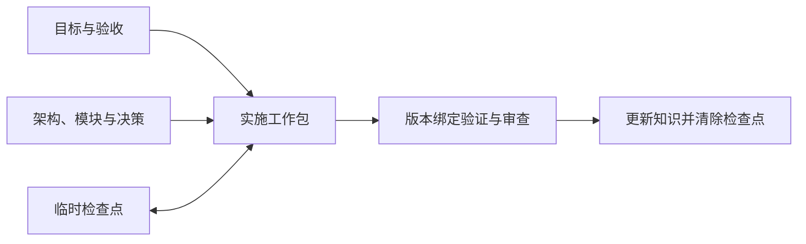

# longtask

**让复杂编码任务跨上下文、跨会话继续推进。**

[](https://github.com/J-ChenX/longtask/actions/workflows/ci.yml)
[](LICENSE)
[](https://www.python.org/downloads/)
[](https://agentskills.io/specification)

longtask 是面向 Codex 的个人编码技能插件。它保存项目知识和未完成任务的检查点，让新会话知道目标、进展和下一步；通过当前版本的验证与审查后，清除临时状态。

[快速开始](#快速开始) · [选择入口](#入口技能) · [文档导航](#文档导航) · [参与贡献](#参与贡献)

## 4.0.0 更新

- 新项目规划明确业务架构、生产方与消费方的数据完整性、技术选型核验，以及前端视觉与交互的前期交付合同。
- 增加逐维度的新项目文档质量案例与独立消费评测；保留失败、缺失和证据失配，避免将采集成功误判为验收通过。
- 完整插件、六个入口及状态中的技能版本统一为 4.0.0；状态结构仍为 `schema_version=3`，旧技能版本检查点与运行证据不直接复用。升级与恢复边界见[发布合同](references/发布与恢复.md#兼容性策略)。

## 适用场景

- 任务需要跨越上下文压缩、重启或多次会话。
- 多个工作包需要分别验收，并协调依赖和集成。
- 架构与决策需要长期维护，验证结果需要对应当前版本。

小改动、解释和普通审查无需自动启用。多窗口协作按实际需要使用隔离工作树；longtask 不替代 Git、CI 或身份认证，也不提供分布式调度。

## 快速开始

需要 **Codex 和 Python 3.14+**；脚本仅使用标准库。Git 可提供版本证据和工作树隔离。

### 1. 获取并验证插件

从源码构建候选归档：

```bash
git clone https://github.com/J-ChenX/longtask.git
cd longtask
python3 scripts/build_release.py build --root . --output dist/longtask-4.0.0.zip
python3 scripts/build_release.py verify --root . --archive dist/longtask-4.0.0.zip
```

构建与验证确认归档和源码一致。安装及发布还需相应验收证据；其他渠道的归档须核对受信 SHA-256。

### 2. 安装完整插件

按[安装指南](references/发布与恢复.md#个人-codex-安装)配置完整插件目录和个人 marketplace，再执行：

```bash
codex plugin add longtask@personal
```

启动新会话，确认下表中的六个入口可用。旧同名技能和安装缓存的处理也见安装指南。

### 3. 提出目标

```text
用 $longtask 推进这个需要多次会话完成的编码任务，明确验收并保存恢复信息。
```

只想规划时，直接说明“先规划，不实施”；需要恢复或审查时，使用对应入口。

## 入口技能

| 你要做什么 | 使用入口 |
|---|---|
| 自动选择工作流 | [`$longtask`](SKILL.md) |
| 为新建或空项目规划目标、架构和工作包 | [`$longtask-setup`](skills/longtask-setup/SKILL.md) |
| 恢复检查点，或为已有架构建立当前任务状态 | [`$longtask-continue`](skills/longtask-continue/SKILL.md) |
| 修改已建立项目的架构、合同或关键技术 | [`$longtask-modify`](skills/longtask-modify/SKILL.md) |
| 为缺少有效检查点和持久架构的已有代码库接入技能 | [`$longtask-retrofit`](skills/longtask-retrofit/SKILL.md) |
| 独立审查实现、文档和版本证据，默认只读 | [`$longtask-review`](skills/longtask-review/SKILL.md) |

六个入口属于同一完整插件，按当前任务选择并加载所需资料。可控任务优先在一个对话内完成；需要拆分时，按[分段交付与会话交接](references/任务推进.md)组织工作。

## 工作原理



- **项目知识**保留在架构、模块和决策文档中，说明项目如何工作与验证。
- **临时检查点**保留在唯一的 `.longtask/state.json` 中，支持未完成任务续接，收尾后清除。
- **版本证据**通过 Git 和摘要绑定具体产物，帮助判断验证、审查及完成声明是否仍有效。

代码证明已观察行为，批准目标与合同定义预期行为；冲突需要协调。恢复视图只提供输入和诊断，不授予执行权限。状态查询、知识读取与失败恢复的具体命令见[操作示例](references/操作示例.md)和[知识检索接口](docs/modules/文档架构.md#知识检索接口)。

## 兼容性与验证边界

**4.0.0 仅支持 Codex。** 不读取或迁移 1.x/2.x/3.x 状态，不支持跨版本回滚；故障恢复使用同版本受信工件。

CI 和本地合同测试证明源码结构及可复现行为。真实宿主发布资格与效率收益需要各自的版本绑定证据，不能从 CI 通过推导。运行结果不进入 Git 或安装包，详见[项目规范](AGENTS.md#源码与产物架构规范)与[发布门](references/发布与恢复.md#单宿主发布门)。

推送与插件版本一致的 `vX.Y.Z` 标签后，GitHub Actions 自动检查、打包并上传安装 ZIP 与校验文件到候选预发布。普通 commit 不生成 Release；候选不会自动升级为正式发布，条件见[标签发布合同](references/发布与恢复.md#github-候选预发布)。

## 本地验证

在仓库根目录使用 Python 3.14+：

```bash
python3 scripts/validate_longtask.py
python3 -m unittest discover -s tests -v
python3 scripts/run_skill_evals.py
python3 scripts/run_forward_evals.py --run
```

这些检查不需要已保存的运行结果。显式核验本地证据用 `validate_longtask.py --with-evaluation-results`，安装工件自检用 `--installed`；正式发布仍须通过 `--require-release-pass`。环境配置、证据更新和命令细节见[贡献指南](https://github.com/J-ChenX/longtask/blob/main/.github/CONTRIBUTING.md#验证变更)。

## 文档导航

| 需要了解 | 阅读 |
|---|---|
| 架构、模块和设计依据 | [架构入口](docs/ARCHITECTURE.md) |
| Skill 格式与仓库维护 | [仓库维护](docs/仓库维护.md) |
| 状态、检查点、授权与完成 | [状态协议](references/状态协议.md) |
| 持久知识与文件命名 | [文档架构](文档架构.md) |
| 独立审查与发现关闭 | [专家审查协议](专家审查协议.md) |
| 多窗口协作与集成 | [平行任务协作](references/平行任务协作.md) |
| 评测方法与证据边界 | [评测协议](references/评测协议.md) |
| 安装、发布与同版本恢复 | [发布与恢复](references/发布与恢复.md) |

## 参与贡献

请先阅读[贡献指南](https://github.com/J-ChenX/longtask/blob/main/.github/CONTRIBUTING.md)与[行为准则](https://github.com/J-ChenX/longtask/blob/main/.github/CODE_OF_CONDUCT.md)，再提交可复现的 [Issue](https://github.com/J-ChenX/longtask/issues/new/choose) 或聚焦的 Pull Request。安全问题按[安全政策](https://github.com/J-ChenX/longtask/blob/main/.github/SECURITY.md)私下报告。

项目采用 [MIT 许可证](LICENSE)；格式遵循 [Agent Skills 规范](https://agentskills.io/specification)，发现与分发参照 [Codex 官方文档](https://developers.openai.com/codex/skills)。
