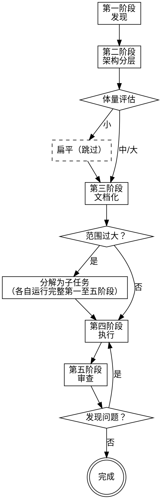

# 长任务编排

## 概述

长任务在会话间丢失上下文时会失败。本技能使用**文档即手册**架构：结构化的领域文档让任何 AI 智能体都能从任意节点恢复工作，无需依赖对话历史。

**核心原则：** 文档即记忆。代码是真相。文档指向代码——永远不要复制实现。

**开始时声明：** "我正在使用 longtask 技能来管理这项工作。"

## 开始：状态检测

**每次技能调用时首先执行。** 根据项目当前状态自动选择入口场景。

### 检测步骤

1. 检查 `docs/ARCHITECTURE.md` 是否存在
   - **不存在** → **场景 A：文档建立** — 项目全新，从第一阶段开始完整走第一至五阶段
   - **存在** → 进入步骤 2

2. 解析 ARCHITECTURE.md 中的模块状态表（骨架/血肉/神经列）

3. 根据状态表判定当前阶段：

| 检测信号 | 当前阶段 | 场景 | 入口 |
|---------|---------|------|------|
| 骨架有 ⬜ | 第二阶段 | B: 继续项目 | 第二阶段恢复节点 |
| 血肉有 ⬜ | 第三阶段 | B: 继续项目 | 第三阶段恢复节点 |
| 神经有 ⬜ | 第四阶段 | B: 继续项目 | 第四阶段恢复节点 |
| 全部 ✅ 且无 review-log.md | 第五阶段 | C: 审查 | 第五阶段独立入口 |
| 全部 ✅ 且 review-log.md 存在 | 已完成 | — | 报告完成状态 |
| 用户明确要求审查 | 第五阶段 | C: 审查 | 第五阶段独立入口 |

4. 向用户报告检测结果：
   - **场景 A：** "未检测到现有项目文档。开始文档建立流程——第一阶段：发现。"
   - **场景 B：** "检测到项目已进入第 N 阶段。骨架 X/Y ✅，血肉 X/Y ✅，神经 X/Y ✅。是否从当前位置继续？"
   - **场景 C：** "检测到所有模块已完成实现。启动第五阶段：多专家审查。"

5. 用户确认后，跳转到对应阶段的恢复节点或入口。

**直达子技能：** 若已知项目状态，可用子技能绕过检测直接进入：
`longtask:setup`（文档建立）、`longtask:continue`（继续任务）、`longtask:review`（审查）、`longtask:modify`（框架修改）、`longtask:retrofit`（既有项目建档）

## 适用场景

**满足以下任一条件时使用：**

- 预计超过 3 个独立工作包，或工作量 > 4 小时
- 架构决策必须在各阶段保持一致（"第一阶段完美，第二至八阶段空白"）
- 任务涉及 2 个以上独立领域（基础设施、业务逻辑、安全、算法）
- 工作可能在中途移交给全新的智能体
- 规模足够大，需要多专家交叉验证

**不适用：**

- 单次对话可完成的任务（< 3 个工作包，< 4 小时）
- 不涉及跨会话协作的一次性修复或小功能
- 无需在阶段间交接、无并行子任务的任务

## 快速参考

| 阶段 | 输入 | 输出 | 门控 |
|------|------|------|------|
| 第一阶段：发现 | 用户描述 | `_INDEX.md` 发现部分 | 用户批准发现记录 |
| 第二阶段：架构分层 | 发现记录 | ARCHITECTURE.md（模块地图 + 构建顺序 + 状态表） | 用户批准分层架构 |
| 第三阶段：文档化 | ARCHITECTURE.md + 发现记录 | 模块文档 + 工作包定义 | 用户批准文档结构 |
| 第四阶段：执行 | 模块文档 + 代码库 | 实现代码 + 更新后的代码指针 | 每个 WP 文档更新后方可标记完成 |
| 第五阶段：审查 | 代码 + ARCHITECTURE.md + 模块文档 | `review-log.md` | 所有阻断项已解决 |

## 五阶段工作流

每个阶段都可以在独立的上下文窗口中运行。智能体通过加载文档而非对话历史来恢复工作。

---

## 第一阶段：发现

**角色：** 倾听者——以理解用户真实目标为首要任务，再以专家视角补全约束  
**输出：** `docs/tasks/{task-id}/_INDEX.md` 的发现部分

**单问规则：每次只问一个问题，等待回答，再问下一个。不要在一条消息中列出多个问题。**

**提问顺序：**

**第一步——先理解目标。** 任何技术角度切入之前，先弄清楚用户想要什么、成功是什么样子。围绕以下方向逐一提问：
- 你想达成什么？完成后，什么变了？
- 谁会用它，他们现在怎么做这件事？
- 什么叫做成功？有没有你不想要的结果？

目标清晰、用户认可后，再进入第二步。

**第二步——逐一覆盖约束角度。** 每个角度选最重要的那一个问题，不穷尽单一角度：

| 角度 | 需揭示的内容 |
|------|-------------|
| 技术约束 | 规模目标、延迟预算、基础设施依赖、不可妥协项 |
| 安全与风险 | 谁访问什么、可能出现什么问题、合规要求 |
| 边界情况 | 失败模式、边界条件、回滚场景 |
| 集成面 | 涉及什么、什么依赖于它、跨系统契约 |

**提问模式切换：** 根据角度自动切换提问方式：

| 角度 | 模式 | 原因 |
|------|------|------|
| 业务意图 | 开放性提问 | 用户领域独特，避免预设答案 |
| 技术约束 | 结构化多选 + 分析 | 技术选型有已知模式和权衡 |
| 安全与风险 | 结构化多选 + 影响评估 | 风险级别有行业标准分类 |
| 边界情况 | 开放性 + 场景引导 | 需激发思考但可提供场景提示 |
| 集成面 | 结构化多选 + 影响范围 | 系统间关系有有限选项 |

结构化选项格式：2-4 个选项，每个含适用场景和影响后果，标注一个推荐选项。结构化多选不算"多个问题"——仍遵循单问规则。
**例外：** 模型可根据具体问题性质灵活调整模式——表中映射为默认建议，非硬性规则。

**存档规则：** 每个确认的答案在确认后立即记录到 `_INDEX.md`。不要等到所有问题都得到回答后再记录。

**恢复节点：** 若上下文在本阶段中断，新智能体：
1. 加载 `docs/tasks/{task-id}/_INDEX.md`
2. 查看哪些发现角度已有答案
3. 从下一个未覆盖的角度继续提问
4. 遵循单问规则——每次只问一个问题

**阶段结束文档义务：** `_INDEX.md` 发现部分必须完整——所有已确认的答案已归档，未解答的问题已列为开放问题。

**预审步骤（阶段门控前）：**
1. 完成发现记录后，启动独立 Agent 预审 `_INDEX.md` 发现部分
2. Agent 以干净视角检查：上下文污染、完整性、清晰度
3. 主 LLM 逐一回应修正后，提交用户确认

**阶段门控：** 用户批准发现记录后，第二阶段方可开始。  
**无人值守时：** 完成当前角度的记录，在 `_INDEX.md` 顶部写入 `状态: 第一阶段 — 等待用户确认`，暂停至下一会话。

---

## 第二阶段：架构分层

**角色：** 架构师——评估体量，建立分层骨架，再进入细节  
**输入：** 第一阶段发现记录  
**输出：** `docs/ARCHITECTURE.md`（项目骨架：模块地图 + 构建顺序 + 状态表）

**核心目的：** 强制从全局到局部的渐进式细化。避免"虎头蛇尾"——在局部采取最优解，却丢失全局架构视角。

**步骤：**
1. 架构师根据发现记录评估任务体量（工作包数、子系统数、工时、领域数）
2. 输出体量评估结论，向用户确认分层策略
3. 创建 `docs/ARCHITECTURE.md`：项目概述、模块清单（骨架状态）、构建顺序、全局技术选型
4. 为每个模块定义职责、依赖关系、在模块清单中注册
5. 生成模块依赖图（文本或 mermaid）

**分层决策矩阵：**

| 工作包 | 子系统 | 工时 | 领域 | 分层 |
|--------|--------|------|------|------|
| < 3 | 1 | < 4h | 1 | 扁平（跳过本阶段） |
| 3–8 | 1–2 | 4–16h | 2 | 2 层 |
| > 8 | 3+ | > 16h | 3+ | 3 层 |

**例外：** 任一维度达到更高层级标准 → 按更高层级处理。用户可覆盖架构师判断。

**三层模型（大体量）：**

| 层级 | 关注点 | 产出 |
|------|--------|------|
| L1 全局层 | 技术栈选型、系统模块划分、跨模块契约 | 模块拓扑 + 接口契约 |
| L2 模块层 | 每个模块的内部设计、接口、数据流 | 模块内部组件图 + 接口签名 |
| L3 细节层 | 组件级实现计划、文件结构、配置 | 文件清单 + 实现步骤 |

**两层模型（中等体量）：** L2 和 L3 融合——全局模块划分后，每个模块直接到实现细节。

**扁平（小体量）：** 跳过本阶段，直接进入第三阶段文档化。

**动态调整：** 执行阶段发现分层不足时，可在当前阶段内升级层数（2→3 层或扁平→2 层），更新 `docs/ARCHITECTURE.md`，不中断已进行中的工作包。

**恢复节点：** 若上下文在本阶段中断，新智能体：
1. 加载 `docs/ARCHITECTURE.md`
2. 检查模块清单中各模块的骨架状态（⬜ 表示未定义）
3. 继续定义缺失的模块（职责、依赖关系）
4. 检查构建顺序是否完整
5. 若所有模块骨架已 ✅ 但用户尚未批准，提交用户确认

**阶段结束文档义务：** `docs/ARCHITECTURE.md` 包含完整的项目概述、模块清单（骨架状态）、构建顺序、全局选型。扁平评估时也需创建简化版 ARCHITECTURE.md。

**预审步骤（阶段门控前）：**
1. 完成 ARCHITECTURE.md 后，启动独立 Agent 预审
2. Agent 检查：模块划分是否合理、构建顺序是否正确、状态表是否完整
3. 主 LLM 修正后提交用户确认

**阶段门控：** 用户批准分层架构后，第三阶段方可开始。  
**无人值守时：** 完成分层架构后，在 `_INDEX.md` 顶部写入 `状态: 第二阶段 — 等待用户确认`，暂停至下一会话。

---

## 第三阶段：文档化

**角色：** 文档架构师  
**输入：** 第一阶段发现记录 + 第二阶段 ARCHITECTURE.md  
**输出：** `docs/modules/{module}/` 中每个模块的血肉文档（overview.md + architecture.md）

参阅 `doc-architecture.md` 获取精确模板。

**步骤：**
1. 基于 ARCHITECTURE.md 模块清单，为每个模块创建 `docs/modules/{module}/overview.md`（必须）
2. 按需创建 `docs/modules/{module}/architecture.md`（模块有 3+ 内部组件或 2+ 外部依赖时）
3. 在每个模块文档中用 MD 引用连接不同视角文档
4. 定义工作包（每个 2–4 小时），映射到具体模块文档章节
5. 更新 ARCHITECTURE.md 中对应模块的血肉状态

**范围检查：** 若工作包超过 8 个，或跨越 3 个以上独立子系统 → 分解。每个子任务运行完整的第一至五阶段周期。父级 ARCHITECTURE.md 成为集成契约。

**恢复节点：** 若上下文在本阶段中断，新智能体：
1. 加载 `docs/ARCHITECTURE.md` 和已创建的模块文档
2. 检查状态表中各模块的血肉状态
3. 为 ⬜ 模块创建 overview.md（必须）和 architecture.md（按需）
4. 标记为 `[计划中 — 代码尚未存在]` 的章节即为待完成项
5. 若所有模块血肉已 ✅ 但用户尚未批准，提交用户确认

**阶段结束文档义务：** 每个模块至少拥有 overview.md，`[计划中 — 代码尚未存在]` 标记已到位，ARCHITECTURE.md 状态表已更新，工作包与模块文档的映射关系已完整填写。

**预审步骤（阶段门控前）：**
1. 完成模块文档后，启动独立 Agent 预审 ARCHITECTURE.md 和模块文档
2. Agent 检查：模块文档是否与 ARCHITECTURE.md 对齐、视角分离是否合理、MD 引用是否有效
3. 主 LLM 修正后提交用户确认

**阶段门控：** 用户批准文档结构和工作分解后，第四阶段方可开始。  
**无人值守时：** 生成完整文档结构后，在 `_INDEX.md` 顶部写入 `状态: 第三阶段 — 等待用户确认`，暂停至下一会话。

---

## 第四阶段：执行

**角色：** 实施者（全新上下文安全——加载文档，而非对话历史）

**恢复节点：** 若在全新上下文窗口中途开始：
1. 加载 `docs/ARCHITECTURE.md`
2. 加载对应模块的 `overview.md` 和 `architecture.md`
3. 需要深入实现时加载 `internals.md`
4. 继续执行——无需对话历史

并行工作包：**必须使用子技能：** `superpowers:subagent-driven-development`

**阶段结束文档义务（每个工作包）：** 工作包完成 = 文档已更新。未更新文档的工作包不得标记为完成，无例外。

**文档更新规则：**
- 为每个新增或变更的组件添加/更新代码指针（文件:行号范围）
- 若签名发生变化，更新接口描述
- 在 `_INDEX.md` 中标记已解决的开放问题
- 绝不粘贴实现代码——仅使用指针和接口签名
- 删除已移除功能对应的文档章节

---

## 第五阶段：审查

**角色：** 多专家小组  
**输入：** 代码 + ARCHITECTURE.md + 模块文档 + 预审发现（若存在）  
**输出：** `docs/tasks/{task-id}/review-log.md`

参阅 `expert-roles.md` 获取专家定义和完整审查协议。

**专家小组（最少 3 人，按需添加领域专家）：**
- `@架构师` — 设计完整性、服务边界、接口稳定性、可扩展性
- `@业务分析师` — 业务规则完整性、不变量执行、规格漂移
- `@安全工程师` — 威胁模型、授权、数据暴露
- `@质量负责人` — 测试覆盖率、回归风险、可测试性
- `@领域专家` — 任务特定（支付、机器学习、基础设施等）

**模拟协议：** 每位专家独立审查——审查过程中切勿混合视角。进入每个角色，得出发现，然后汇总。

**硬性规则：** 过时文档（与实际代码相矛盾的文档）属于**阻断**——与损坏的测试严重性相同。代码正常但文档有误的任务，审查**不通过**。

**作为独立入口（场景 C）：** 当所有模块状态为 ✅ 或用户明确要求审查时：
1. 加载 `docs/ARCHITECTURE.md` 和所有模块文档
2. 确定专家小组组成（最少 3 人，按需添加领域专家）
3. 按模拟协议依次运行每位专家
4. 汇编发现到 `review-log.md`
5. 确定总体状态（通过 / 有条件通过 / 不通过）

**恢复节点：** 若上下文在本阶段中断，新智能体：
1. 加载 `docs/tasks/{task-id}/review-log.md`
2. 检查哪些专家审查已完成（查看已有输出的 `### @{专家名}` 小节）
3. 从下一位未开始审查的专家继续
4. 遵循模拟协议——每位专家独立完成全部审查后再记录发现

**阶段结束文档义务：** `review-log.md` 填写完整；所有"文档过时"发现在审查期间当场修正——文档错误不进入待解决清单，直接修复。

---

## 核心原则

| 原则 | 含义 |
|------|------|
| 文档即记忆 | 文档弥补了跨会话无持久上下文的不足 |
| 阶段终必同步 | 每个阶段结束时文档必须反映当前真实状态——不将文档更新推迟到"下一阶段" |
| 目标先于约束 | 第一阶段先理解用户想要什么，再问技术约束——顺序不能颠倒 |
| 全局先于局部 | 第二阶段先建立 ARCHITECTURE.md 骨架，再进入模块文档化——避免虎头蛇尾 |
| 模块为主，视角为辅 | 文档按模块组织（payment/），模块内按视角分文档（overview/architecture/security）——MD 引用连接 |
| 预审先于确认 | 重要文档在用户看到之前先经过独立 Agent 审查——避免上下文污染传递给用户 |
| 模式随需而变 | 技术问题给结构化选项，业务问题保持开放性提问——让用户高效决策 |
| 代码优先真相 | 当文档与代码冲突时，更新文档——代码优先 |
| 无孤立章节 | 代码被移除时删除对应文档章节 |
| 专家独立性 | 专家在分享前得出结论——避免回音室效应 |
| 先分解后细化 | L1 超过 150 行 → 任务需要拆分 |
| 架构先文档化 | 在编码之前记录决策——而非之后 |

---

## 常见错误

| 错误 | 后果 | 正确做法 |
|------|------|---------|
| 跳过阶段门控直接执行 | 后期发现需求理解偏差，返工成本高 | 必须获得用户确认再推进下一阶段 |
| 跳过架构分层直接文档化 | 在局部采取最优解，丢失全局架构视角 | 中大体量任务必须先分层再文档化 |
| 第一阶段直接问技术约束 | 在不理解用户目标的情况下收集约束，方向可能整体偏差 | 先问目标和成功标准，目标清晰后再问约束 |
| 一次提多个问题 | 用户回答其中一个，其余的丢失或被忽略 | 每次只问一个问题，等待回答再继续 |
| 阶段结束后未同步文档 | 下一阶段的智能体基于过时状态工作 | 每个阶段均有明确的文档义务，阶段不结束直到文档更新完成 |
| 在 ARCHITECTURE.md 写入模块细节 | ARCHITECTURE.md 失去简洁性，不再是快速入口 | 模块细节写入 modules/{name}/ 下的对应视角文档 |
| 在模块 overview.md 中混入安全细节 | 视角混淆，LLM 难以定位安全相关信息 | 安全细节写入 security.md，overview.md 只放业务视角 |
| 复制粘贴实现代码 | 文档成为代码镜像，立即开始过时 | 只写代码指针（文件:行号）和接口签名 |
| 多位专家同时审查并共享发现 | 早期发现污染后续审查，产生回音室效应 | 每位专家独立完成全部审查后再汇总 |
| 将"文档过时"视为警告 | 后续智能体基于错误认识做决策 | 文档过时 = 阻断，与测试失败同等严重 |
| 对小任务启用此技能 | 产生不必要的文档开销 | < 3 个工作包或 < 4 小时，直接执行 |
| 对大体量任务不做分层 | 细节文档缺乏架构骨架，后续智能体迷失在细节中 | 第二阶段必须评估体量，中大体量必须分层 |
| 跳过预审直接提交用户确认 | 上下文污染导致的错误被用户看到，降低信任 | 每个阶段门控前必须完成 Agent 预审 |
| 技术问题用开放性提问 | 用户不知从何回答，发现阶段效率低下 | 技术约束/安全/集成用结构化选项；业务/边界用开放性提问 |
| 未执行状态检测直接开始 | 重复已完成的工作，或在错误阶段浪费时间 | 每次技能调用首先执行状态检测，确定当前阶段和入口场景 |

---

## 分支技能

本技能提供 5 个子技能作为直达入口，绕过主入口的状态检测：

| 子技能 | 场景 | 流程 |
|--------|------|------|
| `longtask:setup` | 全新项目，无 ARCHITECTURE.md | 第一阶段→第五阶段完整流程 |
| `longtask:continue` | 工作中断，需从上次位置恢复 | 状态检测→对应阶段恢复节点→继续至完成 |
| `longtask:review` | 全部 ✅ 或明确要求审查 | 直接进入第五阶段多专家审查 |
| `longtask:modify` | 修改架构/模块/依赖/技术选型 | 影响分析→更新骨架→同步文档→执行→轻量审查 |
| `longtask:retrofit` | 既有代码库无 longtask 文档 | 代码扫描→推断模块→创建文档→质量抽查 |

各子技能详细定义见 `skills/{name}/SKILL.md`。

## 集成

| 技能 | 适用时机 |
|------|---------|
| `superpowers:brainstorming` | 第一阶段前，若需求不明确 |
| `superpowers:writing-plans` | 第四阶段需要正式实施计划时 |
| `superpowers:subagent-driven-development` | 第四阶段并行工作包 |
| `superpowers:requesting-code-review` | 第五阶段正式代码审查 |
| `superpowers:finishing-a-development-branch` | 第五阶段批准后 |

## 支撑文件

- `expert-roles.md` — 专家定义、预审 Agent 角色、模拟协议、审查输出格式
- `doc-architecture.md` — 三层模块化文档模板（ARCHITECTURE.md + 模块视角文档）