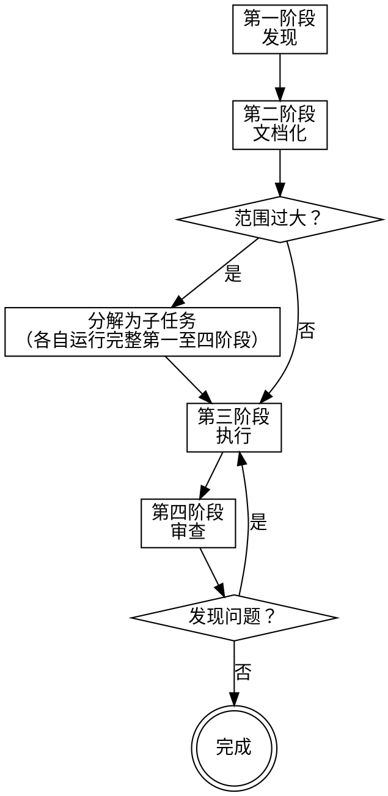

# 长任务编排

## 概述

长任务在会话间丢失上下文时会失败。本技能使用**文档即手册**架构：结构化的领域文档让任何 AI 智能体都能从任意节点恢复工作，无需依赖对话历史。

**核心原则：** 文档即记忆。代码是真相。文档指向代码——永远不要复制实现。

**开始时声明：** "我正在使用 orchestrating-long-tasks 技能来管理这项工作。"

## 适用场景

**满足以下任一条件时使用：**

- 预计超过 3 个独立工作包，或工作量 > 4 小时
- 架构决策必须在各阶段保持一致（"第一阶段完美，第二至八阶段空白"）
- 任务涉及 2 个以上独立领域（基础设施、业务逻辑、安全、算法）
- 工作可能在中途移交给全新的智能体
- 规模足够大，需要多专家交叉验证

**不适用：**

- 单次对话可完成的任务（< 3 个工作包，< 4 小时）
- 不涉及跨会话协作的一次性修复或小功能
- 无需在阶段间交接、无并行子任务的任务

## 快速参考

| 阶段 | 输入 | 输出 | 门控 |
|------|------|------|------|
| 第一阶段：发现 | 用户描述 | `_INDEX.md` 发现部分 | 用户批准发现记录 |
| 第二阶段：文档化 | 发现记录 | 完整 L2 文档 + 工作包定义 | 用户批准文档结构 |
| 第三阶段：执行 | L2 文档 + 代码库 | 实现代码 + 更新后的代码指针 | 每个 WP 文档更新后方可标记完成 |
| 第四阶段：审查 | 代码 + 所有 L2 文档 | `review-log.md` | 所有阻断项已解决 |

## 四阶段工作流

每个阶段都可以在独立的上下文窗口中运行。智能体通过加载文档而非对话历史来恢复工作。

---

## 第一阶段：发现

**角色：** 专家协调者——同时模拟多个领域专家  
**输出：** `docs/tasks/{task-id}/_INDEX.md` 的发现部分

从不同角度逐一提问，循环切换角度。切勿在转向其他角度之前穷尽某一角度。每个确认的答案立即存档。

**必要提问角度（最少）：**

| 角度 | 需揭示的内容 |
|------|-------------|
| 业务意图 | 其存在的原因、成功的标准、业务规则和不变量 |
| 技术约束 | 规模目标、延迟预算、基础设施依赖、不可妥协项 |
| 安全与风险 | 谁访问什么、可能出现什么问题、合规要求 |
| 边界情况 | 失败模式、边界条件、回滚场景 |
| 集成面 | 涉及什么、什么依赖于它、跨系统契约 |

**存档规则：** 每个确认的答案在确认后立即记录到 `_INDEX.md`。不要等到所有问题都得到回答后再记录。

**中途恢复：** 若上下文在本阶段中断，新智能体加载已有的 `_INDEX.md`，查看哪些角度已有答案，从下一个未覆盖的角度继续提问。

**阶段门控：** 用户批准发现记录后，第二阶段方可开始。  
**无人值守时：** 完成当前角度的记录，在 `_INDEX.md` 顶部写入 `状态: 第一阶段 — 等待用户确认`，暂停至下一会话。

---

## 第二阶段：文档化

**角色：** 文档架构师  
**输入：** 第一阶段发现记录  
**输出：** `docs/tasks/{task-id}/` 中完整的两层文档结构

参阅 `doc-architecture.md` 获取 L1/L2 精确模板。

**步骤：**
1. 创建 L1 `_INDEX.md`（主文档，≤150 行）
2. 仅创建本任务所需的 L2 文档
3. 定义工作包（每个 2–4 小时）
4. 将每个工作包映射到 L2 文档章节和专家归属

**范围检查：** 若工作包超过 8 个，或跨越 3 个以上独立子系统 → 分解。每个子任务运行完整的第一至四阶段周期。父级 `_INDEX.md` 成为集成契约。

**中途恢复：** 若上下文在本阶段中断，新智能体加载 `_INDEX.md` 和已有的 L2 文档，继续创建缺失章节或剩余 L2 文件。标记为 `[计划中 — 代码尚未存在]` 的章节即为待完成项。

**阶段门控：** 用户批准文档结构和工作分解后，第三阶段方可开始。  
**无人值守时：** 生成完整文档结构后，在 `_INDEX.md` 顶部写入 `状态: 第二阶段 — 等待用户确认`，暂停至下一会话。

---

## 第三阶段：执行

**角色：** 实施者（全新上下文安全——加载文档，而非对话历史）

**恢复节点：** 若在全新上下文窗口中途开始：
1. 加载 `docs/tasks/{task-id}/_INDEX.md`
2. 加载你工作包对应的 L2 文档
3. 继续执行——无需对话历史

并行工作包：**必须使用子技能：** `superpowers:subagent-driven-development`

**硬性门控：** 每个完成的工作包必须在标记为完成之前更新相关 L2 文档。无例外。

**文档更新规则：**
- 为每个新增或变更的组件添加/更新代码指针（文件:行号范围）
- 若签名发生变化，更新接口描述
- 在 `_INDEX.md` 中标记已解决的开放问题
- 绝不粘贴实现代码——仅使用指针和接口签名
- 删除已移除功能对应的文档章节

---

## 第四阶段：审查

**角色：** 多专家小组  
**输入：** 代码 + 所有 L2 文档  
**输出：** `docs/tasks/{task-id}/review-log.md`

参阅 `expert-roles.md` 获取专家定义和完整审查协议。

**专家小组（最少 3 人，按需添加领域专家）：**
- `@架构师` — 设计完整性、服务边界、接口稳定性、可扩展性
- `@业务分析师` — 业务规则完整性、不变量执行、规格漂移
- `@安全工程师` — 威胁模型、授权、数据暴露
- `@质量负责人` — 测试覆盖率、回归风险、可测试性
- `@领域专家` — 任务特定（支付、机器学习、基础设施等）

**模拟协议：** 每位专家独立审查——审查过程中切勿混合视角。进入每个角色，得出发现，然后汇总。

**硬性规则：** 过时文档（与实际代码相矛盾的文档）属于**阻断**——与损坏的测试严重性相同。代码正常但文档有误的任务，审查**不通过**。

---

## 核心原则

| 原则 | 含义 |
|------|------|
| 文档即记忆 | 文档弥补了跨会话无持久上下文的不足 |
| 代码优先真相 | 当文档与代码冲突时，更新文档——代码优先 |
| 无孤立章节 | 代码被移除时删除对应文档章节 |
| 专家独立性 | 专家在分享前得出结论——避免回音室效应 |
| 先分解后细化 | L1 超过 150 行 → 任务需要拆分 |
| 架构先文档化 | 在编码之前记录决策——而非之后 |

---

## 常见错误

| 错误 | 后果 | 正确做法 |
|------|------|---------|
| 跳过阶段门控直接执行 | 后期发现需求理解偏差，返工成本高 | 必须获得用户确认再推进下一阶段 |
| 在 L1 写入领域细节 | L1 超出 150 行，失去快速恢复价值 | 细节写入 L2 文档，L1 只写摘要和指针 |
| 复制粘贴实现代码 | 文档成为代码镜像，立即开始过时 | 只写代码指针（文件:行号）和接口签名 |
| 工作包完成后忘记更新文档 | 下一个智能体基于错误地图工作 | 文档更新是 WP 完成的前提，不是后续步骤 |
| 多位专家同时审查并共享发现 | 早期发现污染后续审查，产生回音室效应 | 每位专家独立完成全部审查后再汇总 |
| 将"文档过时"视为警告 | 后续智能体基于错误认识做决策 | 文档过时 = 阻断，与测试失败同等严重 |
| 对小任务启用此技能 | 产生不必要的文档开销 | < 3 个工作包或 < 4 小时，直接执行 |

---

## 集成

| 技能 | 适用时机 |
|------|---------|
| `superpowers:brainstorming` | 第一阶段前，若需求不明确 |
| `superpowers:writing-plans` | 第三阶段需要正式实施计划时 |
| `superpowers:subagent-driven-development` | 第三阶段并行工作包 |
| `superpowers:requesting-code-review` | 第四阶段正式代码审查 |
| `superpowers:finishing-a-development-branch` | 第四阶段批准后 |

## 支撑文件

- `expert-roles.md` — 专家定义、模拟协议、审查输出格式
- `doc-architecture.md` — L1 和 L2 文档模板
