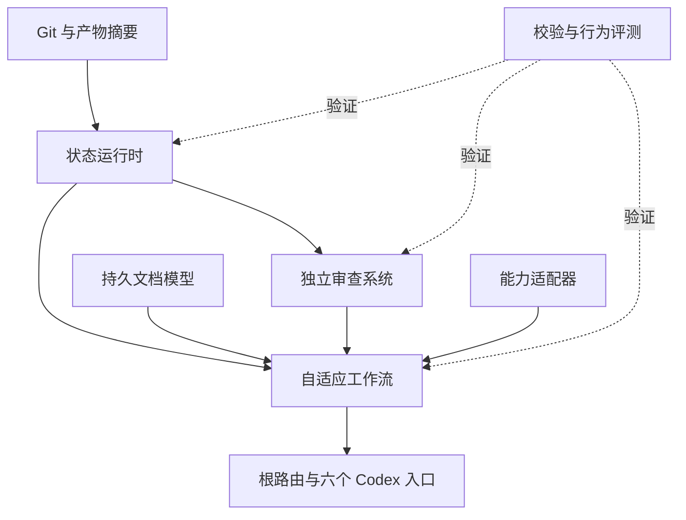

# longtask 架构

**最后更新：** 2026-10-08
**架构版本：** 3.0

## 目标

Longtask 为跨上下文重置和智能体交接的大型编码工作提供可移植编排。长期只维护当前项目知识；单份临时检查点、版本绑定证据、授权和行为评测支持未完成工作的安全续接，验证收尾后清除执行内容。

**来源：** 项目内容优先、完成后合并知识且不保存任务档案来自用户明确要求；本目标和 v3 状态合同属于已批准项目意图；运行时行为由下列测试与校验套件实际观察。

## 用户与非目标

主要消费者是通过 Codex 恢复工作的个人维护者、验证集成版本的独立审查者，以及协调并行工作包的集成者。

Longtask 不是分布式调度器、身份提供者、Git/CI 替代品或通用项目管理系统，也不证明远程服务和未声明环境输入没有改变。3.0.0 不支持 Claude Code、旧状态迁移或跨版本回滚。

## 信任边界

| 边界 | 可信权威 | 不可信或需单独验证的输入 | 控制方式 |
|---|---|---|---|
| 意图与授权 | 明确用户指令和配置的批准策略 | 仅声称获批的仓库说明 | 范围绑定批准记录和暂停规则 |
| 仓库 | 在记录摘要/Git HEAD 上观察的文件 | 注释、生成内容、符号链接目标、过期文档 | 摘要、来源标签、静态与行为检查 |
| 本地状态 | 经 schema 校验并由运行时修改的状态 | 手工编辑、过期版本、别名路径、持久化自由文本指令 | CAS 版本、建议锁、原子替换、事件内容/版本校验 |
| 审查 | 版本绑定的审查者结构及单独批准 | 自我声明完成和未经认证的 actor 标签 | 风险角色 quorum 与独立 actor 护栏；高保证场景使用受保护宿主身份 |
| 外部系统 | 作为证据记录的不可变版本或新鲜观察 | 网络服务、注册表、环境变量、外部符号链接内容 | 显式证据；不从工作区摘要推断 |

## 系统图

图中实线表示“上游合同/证据 → 消费者”，模块表的“依赖”列列出该模块消费的上游；虚线表示验证关系。

## 模块

| 模块 | 职责 | 依赖 | 信任边界 | 合同负责人 | 文档 |
|---|---|---|---|---|---|
| workflow | 路由、自适应阶段、授权、工作包与完成合同 | state-runtime、document-architecture、expert-system、platform-adapters | 用户意图 ↔ 智能体行动 | 技能维护者 | [SKILL.md](../SKILL.md)、[模块](modules/任务编排.md) |
| state-runtime | 机器状态、结构化交接、摘要、批准、检查点、路由和并发保护 | Git（可用时） | 工作区 ↔ 临时恢复声明 | 状态运行时维护者 | [协议](../references/状态协议.md)、[工具](../scripts/longtask_state.py)、[模块](modules/状态运行时.md) |
| document-architecture | 持久知识层、来源、稳定引用、延续/展开 | 无内部上游 | 预期行为 ↔ 已观察行为 | 文档维护者 | [文档架构](../文档架构.md)、[模块](modules/文档架构.md) |
| expert-system | 按风险选择独立审查、信任审查、发现与关闭 | state-runtime | 实现者 ↔ 独立验证者 | 审查集成者 | [专家协议](../专家审查协议.md)、[模块](modules/专家审查.md) |
| platform-adapters | 按能力使用目标、会话、压缩、钩子、子智能体、工作树 | 宿主能力（外部） | 可移植合同 ↔ 宿主能力 | 适配器维护者 | [平台适配器](../references/平台适配器.md) |
| evaluation | 静态/打包校验、状态单元测试、调用与前向评测语料 | 所有模块 | 声称的质量 ↔ 测得的行为 | 评测维护者 | [评测协议](../references/评测协议.md)、[模块](modules/评测体系.md) |
| entry-skills | 与根技能共同打包的五个明确直达入口 | workflow 和共享参考 | 发现元数据 ↔ 选定工作流 | 技能维护者 | [技能目录](../skills/) |

## 集成顺序

1. 事实/来源与授权不变量定义可以声称或改变什么。
2. 状态 schema 和工具把执行声明绑定到产物；旧代际 CAS 与新检查点快照分离，已启动包的恢复不重写基线；modify 在原任务中冻结受影响依赖闭包，状态更新不会替代用户授权。
3. 工作流与入口技能消费状态和持久文档。
4. 审查把发现和批准绑定到集成版本。
5. 校验/评测测试路由、恢复、并发、打包和完成。

并行只读审查是安全的。修改 `SKILL.md`、状态 schema/工具、清单、架构、锁文件或共享索引时，由单一集成者写入。

独立窗口实施时按领域划分可写范围，每个工作树保留本地检查点；每项共享资源和集成链路指定有界负责人，不要求常驻全局总控。外部依赖消费是工作流策略，状态运行时不提供跨根 DAG、分布式锁或自动唤醒。唯一策略来源见[平行任务协作](../references/平行任务协作.md)。

## 跨模块合同

| 合同 | 生产者 | 消费者 | 验证负责人 | 验证方式 |
|---|---|---|---|---|
| v3 临时检查点 | state-runtime | workflow、adapters、review | 状态运行时维护者 | task-id/revision 双 CAS + schema/状态测试 |
| 证据代际 | state-runtime | 工作包、阶段、审查、完成门 | 审查集成者 | 重放与合同变化测试 |
| 结构化交接帧 | state-runtime | workflow、entry-skills、review | 状态运行时维护者 | 冻结摘要/HEAD/epoch、意图路由、缺失帧拒绝与审查失败循环测试 |
| 产物摘要 | state-runtime | 批准、审查、完成 | 质量审查者 | 确定性摘要、漂移和失败后验收边界测试 |
| 持久知识模型 | document-architecture | workflow、retrofit、reviewers | 文档审查者 | 静态校验 + 恢复评测 |
| 审查者结构 | expert-system | workflow/状态审查门 | 审查集成者 | 逐工作包角色覆盖、reviewer quorum 与 schema 对抗测试 |
| 调用语料 | evaluation | 技能发现评测者 | 评测维护者 | 平衡盲测结果评分 |
| 发布资源闭包 | `release-manifest.json` | Codex 个人 marketplace 安装、宿主评测与当前版本恢复 | 发布维护者 | 确定性双构建、逐文件摘要、受信归档摘要、隔离提取和个人市场模板校验 |
| 仓库内容与技能展示 | 首页、社区入口、六个 `agents/openai.yaml` | 使用者、贡献者、Codex 发现界面 | 仓库维护者 | Skill/展示校验、发现面绑定、PR CI 与归档导航闭包 |

## 架构决策

| ID | 状态与负责人 | 决策 | 替代方案与拒绝理由 | 后果 | 已检查证据 | 重新考虑与回滚 |
|---|---|---|---|---|---|---|
| ADR-001 | approved；技能维护者 | 分离已批准意图、已观察实现和验证证据。 | 万能真相来源会隐藏冲突；只依赖代码会把行为误当需求。 | 协调显式可见，但需要来源标签。 | 项目不变量；2026-09-04 | 仅当更强模型仍保留冲突可见性时考虑；恢复到同版本完整、内部一致且可验签的备份工件。 |
| ADR-002 | approved；状态运行时维护者 | 使用单份 `.longtask/state.json` 临时检查点、`schema_version=3`、`skill_version=3.0.0` 和代际/revision CAS；完成知识合并及验证后清除，不建立任务历史。 | Markdown 状态有歧义；运行时迁移器扩大安全与维护表面。 | 旧执行材料不迁移、不默认归档；仍有效的项目事实合并到文档后，新工作初始化临时检查点。 | 单检查点生命周期、知识收敛门、旧版本拒绝与并发测试；2026-09-07 | 不在 3.x 运行时恢复兼容分支。 |
| ADR-003 | approved；审查集成者 | 把检查、审查、批准和完成绑定到产品摘要、证据代际、贡献者历史和 Git HEAD；临时检查点不进入产品摘要。 | 时间戳、说明日志或自引用摘要不能证明新鲜度。 | 产品变更使证据失效，当前检查点证据可安全更新，完成后清除。 | 对抗完成、检查身份与摘要测试；2026-09-04 | 签名证明成熟时考虑。 |
| ADR-004 | approved；技能维护者 | 使用风险/授权暂停与证据支持的阶段出口。 | 每阶段强制批准会增加仪式；无限自主会越界。 | 低风险工作可流动，不可逆选择仍会停止。 | 工作流测试；2026-09-03 | 错误暂停或不安全自主超过评测阈值时考虑。 |
| ADR-005 | approved；文档维护者 | 根文件保留共享路由/不变量，按需加载参考。 | 单一大提示浪费上下文；过深间接层不利恢复。 | 发现面小，并仅有一层条件细节。 | Agent Skills 规范；2026-09-03 | 宿主发现限制实质改变时考虑；恢复同版本完整备份。 |
| ADR-006 | approved；发布维护者 | 根入口与嵌套入口按 `release-manifest.json` 构建为一个 Codex 原生确定性闭包；安装、宿主验证和当前版本恢复只使用经外部 SHA-256 认证的完整归档。 | 直接复制可变工作区无法证明被审字节等于部署字节；保留未验证宿主与旧版兼容路径会扩大个人项目的伪绿和维护表面。 | 发布面更小；3.0.0 与旧插件/状态完全不兼容，故障时只做当前版本备份恢复和完整重装。 | 确定性双构建、内嵌逐文件清单、Codex manifest 预检、单宿主关闭式证据门；2026-09-04 | 发布与恢复见[当前版本合同](../references/发布与恢复.md)。 |
| ADR-007 | approved；文档维护者 | 人读型文档采用职责概括后的中文名称，宿主入口与状态文件保留固定名称。 | 全部使用英文降低中文项目的浏览效率；翻译机器入口会破坏发现与恢复。 | 导航更直观，同时增加重命名时修复全部引用和跨平台校验的义务。 | 本地链接、技能打包与状态测试；2026-09-03 | 用户指定其他文档语言或宿主不支持 Unicode 路径时按项目级规则回退；恢复固定英文资源名。 |
| ADR-008 | approved；安全与状态维护者 | 便携状态运行时只承诺合作式内部一致性；认证身份、真实人工批准和防篡改审计由宿主边界提供。 | 把自由文本 actor 当作认证会产生虚假保证；内置身份系统会破坏可移植性并扩大项目范围。 | 默认完成声明必须标注 cooperative；高保证部署需要宿主 attestation。 | 授权绕过审查与对抗状态测试；2026-09-03 | 出现可移植、可验证的宿主证明标准时扩展 schema；保留合作式降级路径。 |
| ADR-009 | approved；审查集成者 | 工作包以风险、必需角色和 `covered_package_ids` 驱动逐包审查 quorum。 | 角色全局并集不能证明审查了对应包。 | 高风险包至少两个独立 actor，并覆盖该包全部角色。 | 无关 scope 与 actor 别名对抗测试；2026-09-04 | 有认证 principal 时替代 actor 字符串。 |
| ADR-010 | approved；状态运行时维护者 | 工作包执行前摘要不可变；active 转换保存同次扫描的逐路径指纹清单；目录写集对现有后代执行解析路径/inode/link-count 检查，文件系统异常结构化失败；结果版本由验收证据表达。 | 仅有聚合摘要不能证明变化归属；仅检查目录节点会漏掉后代别名；只比较工作区内 inode 无法发现外部硬链接；未捕获循环链接会破坏自动恢复接口。 | 单包仅允许写集内变化；同批次停止包用冻结指纹保持可核对归属，续租/受控恢复保留原基线；目录外逃、链接别名及越界仍失败关闭。 | 并行唯一归属、目录后代/外部硬链接、外逃与循环符号链接、不可变基线及最终重验测试；2026-09-03 | 保守禁止同包硬链接；指纹不含内容；协调点检查不能替代宿主强隔离；可恢复回滚仍须独立来源。 |
| ADR-011 | approved；状态运行时维护者 | 单个 handoff 帧绑定摘要、HEAD、epoch 和创建 revision；任何后续状态变更都使其过期。批准单独保存不可变 HEAD，所有变更检测 HEAD 漂移并推进证据代际。 | 仅内容摘要无法发现包状态、阻塞项或证据生命周期变化。 | 恢复更保守，但不会重复执行已完成断点。 | handoff 后状态变化测试；2026-09-04 | 可验证原生 continuation 成熟时映射该帧。 |
| ADR-012 | approved；安全与发布维护者 | 发布输出和状态写入固定在逐级无跟随打开的目录句柄内；工作区摘要采用有界流式读取，合作式 actor 使用 ASCII 标识。 | 路径预解析、无界读取和 Unicode 同形身份会分别造成越界写入、资源耗尽或独立性误判。 | 不安全路径、超限工件和含混身份统一失败关闭。 | 输出/锁祖先链接、摘要增长/超限和同形 actor 对抗测试；2026-09-04 | 受保护宿主 principal 可替代合作式 actor，但不得弱化本地边界。 |
| ADR-013 | approved；评测维护者 | 个人核心发布与收益验收分开；重复行为验收、真实版本绑定、必要授权及同版本恢复仍为硬门。适用性需证据，未知遥测不归零。 | 强制所有任务产生原生审批/交接标识会拒绝合法场景；用未知零值和未执行对照混合核心资格会产生误判。 | 源码保存易变运行结果，随包只保留合同/案例/测试；规则以评测协议为准。 | 用户于2026-09-07批准发布门审查后的调整；实现验证另由当前证据绑定。 | 若需认证部署或收益声明，按实际风险增加可验证证据，不伪造宿主能力。 |

## 操作与验证合同

仓库公开内容、Skill 格式与项目约定的职责见[仓库维护](仓库维护.md)。GitHub 社区入口与自动化仅服务源码仓库；当前 `docs/` 知识进入安装闭包。技能运行环境要求 Python 3.14+，CI 使用单一 Python 3.14 任务检查源码与本地合同，不承担真实宿主发布或收益证明。

工作区摘要以调用方的原始根为边界：祖先路径不得跟随符号链接，嵌套 Git 内容共享总读取预算，只有原始根的运行态可排除。环境验证失败与产品审查发现分别恢复；同摘要重验不得掩盖产品阻断。审查结构同时冻结任务身份、证据代际与 HEAD，迟到结果不能被登记为新合同的证据。恢复诊断只返回结构化候选操作，精简输出仍保留 CAS 身份与版本绑定。

静态文档校验依据实际链接和当前目录合同，不维护历史文件名黑名单；覆盖边界见[评测体系](modules/评测体系.md)。

源码发布门和已安装工件自检分别验证各自输入；真实宿主证据留在归档外，测试使用明确的合成 fixture。模式结果由全部独立样本聚合，样本顺序不能改变判定。操作示例须由实际 CLI 回归执行，故障恢复须以当前版本证据验证。

初始化以早期检查点和逐步交接为顺序约束。规划助手只组合现有状态 CLI，不引入第二份状态、审批或完成语义；具体操作见[任务编排](modules/任务编排.md#初始化保存边界)。

入口与恢复的加载范围和授权沿用规则由[安全启动](../SKILL.md#安全启动)定义；运行时只验证候选动作可用性，不推断用户授权。

工作流以[推进与停止条件](../SKILL.md#推进与停止条件)约束目标锚点、分支进入/返回条件、规划深度与执行顺序，审查按[审查收敛](../专家审查协议.md#审查收敛)区分必要修复与可选改进。该策略来自用户对细节空转的优化要求，不改变 v3 状态、版本绑定及完成合同；行为验收输入见[推进与收敛场景](../references/评测协议.md#推进与收敛行为场景)。

分段交付沿[分段目标](../SKILL.md#分段目标)复用工作包依赖和交接；整体交付会话沿[主线推进](../references/平行任务协作.md#主线推进)消费窗口反馈并继续可执行验收。Git 提交的语言约定由[变更与完成](../SKILL.md#变更与完成)维护。这些用户批准的工作流约束不增加目标账本、状态字段或外部操作授权。

会话策略以[会话预算与递进交接](../SKILL.md#会话预算与递进交接)优先单对话完成和有界片段，按领域并行或按步骤顺序移交；相关写入边界见[拆分方向与递进移交](../references/平行任务协作.md#拆分方向与递进移交)。宿主自动压缩不可由便携状态运行时禁止。

以上属于用户批准的预期合同；实际验收由状态、发布、前向与宿主四层证据分别证明。

## 当前设计依据

检查日期：2026-10-04（本次复核 Astra 技能与提示词指导；其他来源未重新核验）。

- OpenAI 的 [GPT-6 Astra 技能与提示词指导](https://developers.openai.com/blog/rethinking-skills-and-prompts-for-gpt-6-astra)建议精确而简短的描述、按需加载、减少过程脚本和明确完成边界。本项目据此保留可验证的状态/证据约束，将任务推进策略集中在根技能；模型行为收益仍需独立实测。
- [Agent Skills 规范](https://agentskills.io/specification)定义了发现元数据、目录/名称限制、按需参考、自包含脚本，并建议根文件少于 500 行。规范或宿主校验规则改变时重新检查。
- OpenAI 的 [Harness Engineering 指南](https://openai.com/index/harness-engineering/)支持简短的 `AGENTS.md` 导航、仓库内知识、机械化架构检查、隔离工作树和持续清理。Codex 的上下文、会话或多智能体模型实质改变时重新检查。
- OpenAI 的[评测最佳实践](https://developers.openai.com/api/docs/guides/evaluation-best-practices)和[智能体评测指南](https://developers.openai.com/api/docs/guides/agent-evals)要求代表性/对抗数据、持续评测、人工校准和端到端 trace grading。因此，调用分类、确定性状态合同与真实 agent execution 分层保存，不能互相替代。

这些来源只提供约束依据，不覆盖仓库说明、用户授权或已观察验证证据。

## 降级运行

没有 Git 时，摘要仍可检测内容漂移，但来源保证较弱。没有子智能体/工作树时，审查或写入按顺序执行。没有钩子/原生目标时，显式状态命令执行相同的可移植不变量。

## 恢复入口

- 项目知识从本文件及模块索引加载；不依赖任务档案。
- 若存在未完成检查点，运行状态工具 `route` 校验后恢复；完成收尾后检查点内容不存在，下一次按当前项目内容和用户目标开始。
- 当前插件部署、验证和恢复步骤见[发布与恢复](../references/发布与恢复.md)。

## 验证边界

临时检查点只在当前工作期间保存工作流门及证据引用，`evals/host_results.json` 保存绑定归档的宿主执行证据。静态校验、状态合同、调用分类和黑盒执行必须分别报告；任一绿色结果都不能替代其他层。

宿主采集通过 `scripts/collect_host_trace.py` 连接实际 Codex App Server，保留私有外部 trace；采集成功与安装验证、人工校准和发布通过分别判定，详细合同见[评测体系](modules/评测体系.md)。

发现入口的界面配置位于 `skills/longtask/agents/openai.yaml`，与宿主加载的入口目录一致；终态诊断不要求不存在的退出阶段，采集器取消与退出均清理自有进程组。
