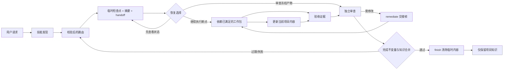

# 任务编排

**最后更新：** 2026-10-10

## 职责

路由大型任务、维护授权和事实边界、让阶段适应证据，并阻止未经证明的完成。

## 核心流程

| 阶段 | 必要结果 | 权威来源 |
|---|---|---|
| 路由 | 根据明确意图、已校验工作区状态和新鲜 handoff 建议入口；沿用会话有效授权，动作依据不足时询问恢复选择 | [SKILL.md](../../SKILL.md)、`longtask_state.py route` |
| 发现 | 目标、非目标、验收、约束、风险、来源 | 项目架构中的目标与约束、临时检查点 |
| 架构 | 边界、合同、决策、回滚、工作包 DAG | `docs/ARCHITECTURE.md`、模块/决策文档 |
| 执行 | 带工作包验收证据的集成改动 | 代码、Git/摘要、临时检查点 |
| 审查 | 绑定当前产物的独立风险覆盖 | 临时检查点的结构化 review 证据 |
| 完成 | 项目知识已合并、完成不变量已验证、临时内容已清除 | `knowledge` 证据与 `finish` |

所需证据已存在时可以合并阶段工作；阶段名称永远不能替代其证据。

## 合同导航

面向使用者的简介与执行指令分开维护，文档职责见[说明文档分工](../仓库维护.md#说明文档分工)。入口展示只概括用途，不增加执行权限或第二份流程。

根技能只维护入口、必要不变量和完成边界；主线/分支、分段及会话细节仅在对应决策时加载[任务推进](../../references/任务推进.md)。普通恢复按[续接消费合同](../../references/任务续接.md#恢复决策)消费 `context` 的只读视图；模式明确且无恢复需求时直接加载所选模式参考。资料/查询/检查的复用与刷新条件统一见[按需消费与验证](../../references/任务推进.md#按需消费与验证)，不把工具查询当作入口仪式。

共享事实与授权边界见[根技能](../../SKILL.md)，状态、交接及工作包规则见[状态协议](../../references/状态协议.md)，独立审查与发现关闭见[专家审查协议](../../专家审查协议.md)。模块文档不重复维护这些规则。

已有任务的 L4 变更由 `longtask_state.py modify` 转入架构阶段，保留原目标和不受影响的工作包；不能通过新建任务或改写 goal 代替该流程。

单一公开入口下的五种模式由[根技能的模式导航](../../SKILL.md#模式参考)维护。验证边界统一见[评测协议](../../references/评测协议.md)。

## 数据流

`modify` 命令在原任务记录架构变更，冻结受影响工作包及传递消费者并使证据失效；只有证明输入和写集彼此独立时，不受影响的工作包才能继续。

实际命令与故障恢复见[操作示例](../../references/操作示例.md)。

## 初始化保存边界

新项目先建立目标检查点，再逐步编写持久文档；规划助手 `scripts/planning_checkpoint.py` 只通过既有状态 CLI 保存 planned 包与交接，沿用任务身份、CAS、摘要和代际校验。每个保存边界刷新交接，但多条命令不声明为单一事务。仅规划时不自动批准、推进阶段或完成应用；常规操作的唯一说明见[初始化与交接](../../references/初始化与交接.md)。

setup 的设计产物按[新项目输出合同](../../文档架构.md#新项目输出合同)定向消费业务、技术、架构与前端规格；规划深度及下一实现者能否继续的判断仅由[规划充分性与出口](../../references/初始化与交接.md#规划充分性与出口)定义。模块和工作包通过现有合同引用关联，不新增设计状态字段、决策账本或完整矩阵阅读要求。

目标锚点、主线验收进展、分支准入与返回、插入请求处理和推进停止条件统一见[推进与停止条件](../../references/任务推进.md#推进与停止条件)；阶段与工作包运行时合同保持不变。会改变后续决策的发现、失败及保存触发统一见[发现与保存事件](../../references/任务推进.md#发现与保存事件)，长期知识的去向仍由[文档架构](../../文档架构.md#知识合并与清理)定义。

交接继续消费既有 `goal`、工作包及 `handoff` 字段，按根技能的推进策略选择局部动作；不增加 schema 字段或独立的分支任务账本。运行时校验结构与新鲜度，动作是否服务总目标仍由智能体结合用户意图判断。

分段交付策略与包/交接映射的唯一来源是[分段目标](../../references/任务推进.md#分段目标)，Git 提交的默认语言见[变更与提交](../../references/任务推进.md#变更与提交)。这些是智能体工作流合同；现有状态工具仍只校验包依赖、版本绑定与完成门，不从层次名称或提交语言推导通过。

会话规模、最小结果传递、历史按需回查及实际接管见[会话预算与递进交接](../../references/任务推进.md#会话预算与递进交接)。根入口和 continue 参考在确定跨会话片段时导航该策略；模型使用宿主会话工具，状态工具只绑定恢复帧，不控制上下文预算或自动压缩，也不派发接收会话。

压缩前事件、模型实际收到的预警与宿主停止能力按[平台合同](../../references/平台适配器.md#压缩信号与停止)分开检测；交付只读[信号桥](../../references/平台适配器.md#内置压缩信号桥)，受信后为压缩后的首次请求提供出口导航，模型仍通过原生工具接管。停止旧轮不能代替接续派发、后台写入处置或总目标完成。

入口先限定当前目标，再加载相关资料。已有项目接入可作为整体实施的前置步骤；接入完成后继续原任务。恢复选项的可用性由运行时判断，选择依据由根技能的安全启动规则结合会话授权判断。

## 独立窗口

多窗口的领域写集、命名、原生会话创建/复用、指令派发、公共合同与跨模块接线按[平行任务协作](../../references/平行任务协作.md)组织；该参考仅在实际拆分/创建/协作需要时加载。每个工作树沿用既有 v3 本地状态，不增设全局账本、调度服务或 schema 字段；状态工具的检查边界不扩展为跨工作树保证。

整体交付会话如何消费子窗口反馈、推进独立验收与恢复等待见[主线推进](../../references/平行任务协作.md#主线推进)。仅派发与整体实施仍以各自用户授权范围验收。

按领域并行与按步骤顺序移交的写入边界见[拆分方向与递进移交](../../references/平行任务协作.md#拆分方向与递进移交)，两者共享本地单写入者与版本绑定合同。

维护 longtask 本身时，设计和收尾消费[版本推进](../../references/发布与恢复.md#版本推进)，依据累计合同影响决定是否同步版本；对用户项目使用项目自身发布合同，不复制 longtask 版本策略。
