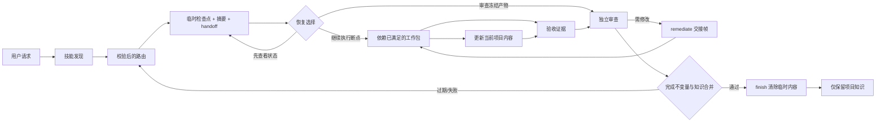

# 任务编排

**最后更新：** 2026-09-07

## 职责

路由大型任务、维护授权和事实边界、让阶段适应证据，并阻止未经证明的完成。

## 核心流程

| 阶段 | 必要结果 | 权威来源 |
|---|---|---|
| 路由 | 根据明确意图、已校验工作区状态和新鲜 handoff 建议入口；笼统继续请求先询问恢复选择 | [SKILL.md](../../SKILL.md)、`longtask_state.py route` |
| 发现 | 目标、非目标、验收、约束、风险、来源 | 项目架构中的目标与约束、临时检查点 |
| 架构 | 边界、合同、决策、回滚、工作包 DAG | `docs/ARCHITECTURE.md`、模块/决策文档 |
| 执行 | 带工作包验收证据的集成改动 | 代码、Git/摘要、临时检查点 |
| 审查 | 绑定当前产物的独立风险覆盖 | 临时检查点的结构化 review 证据 |
| 完成 | 项目知识已合并、完成不变量已验证、临时内容已清除 | `knowledge` 证据与 `finish` |

所需证据已存在时可以合并阶段工作；阶段名称永远不能替代其证据。

## 合同导航

共享事实与授权边界见[根技能](../../SKILL.md)，状态、交接及工作包规则见[状态协议](../../references/状态协议.md)，独立审查与发现关闭见[专家审查协议](../../专家审查协议.md)。模块文档不重复维护这些规则。

已有任务的 L4 变更由 `longtask_state.py modify` 转入架构阶段，保留原目标和不受影响的工作包；不能通过新建任务或改写 goal 代替该流程。

五个直达入口由[根技能的模式导航](../../SKILL.md#模式参考)维护。验证边界统一见[评测协议](../../references/评测协议.md)。

## 数据流

`modify` 命令在原任务记录架构变更，冻结受影响工作包及传递消费者并使证据失效；只有证明输入和写集彼此独立时，不受影响的工作包才能继续。

实际命令与故障恢复见[操作示例](../../references/操作示例.md)。

## 初始化保存边界

新项目先建立目标检查点，再逐步编写持久文档；规划助手 `scripts/planning_checkpoint.py` 只通过既有状态 CLI 保存 planned 包与交接，沿用任务身份、CAS、摘要和代际校验。每个保存边界刷新交接，但多条命令不声明为单一事务。仅规划时不自动批准、推进阶段或完成应用；常规操作的唯一说明见[初始化与交接](../../references/初始化与交接.md)。
